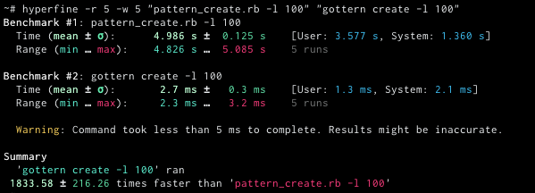
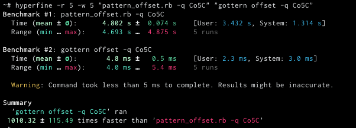

[](https://github.com/joanbono/gottern/issues)
[](https://github.com/joanbono/gottern/tags)
[](https://golang.org/dl/)
[](https://www.apache.org/licenses/LICENSE-2.0)
[](https://goreportcard.com/report/github.com/joanbono/gottern)


Golang port for Metasploit's `pattern_create` and `pattern_offset`.  
Based on [`haxpattern`](https://github.com/DharmaOfCode/haxpattern)

## Usage

```bash
$ gottern -h
Usage of gottern:
    -b	        Big Endian
    -c int      pattern_create
    -o string   pattern_offset
```
 
### Create a pattern 

 Create a pattern using the `-c` flag with the size of the pattern to be created.
 
 ```bash
 $ gottern -c 200
Aa0Aa1Aa2Aa3Aa4[...]Ag1Ag2Ag3Ag4Ag5Ag
```

### Look for an offset

```bash
# ASCII 
$ gottern -o 6Aj7
[*] 290
# Plain HEX
$ gottern -o 0x36416a37
[*] 290
# Little Endian HEX
$ gottern -o 376a4136
[*] 290
# Big Endian HEX
$ gottern -o 36416a37 -b
[*] 290
```

***

## Benchmarks

### Create a Pattern

 

### Find an offset

 
